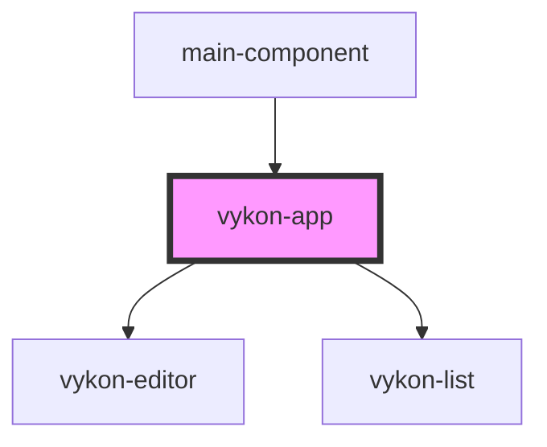

# vykon-app

<!-- Auto Generated Below -->

## Properties

| Property   | Attribute   | Description | Type     | Default |
| ---------- | ----------- | ----------- | -------- | ------- |
| `apiBase`  | `api-base`  |             | `string` | `''`    |
| `basePath` | `base-path` |             | `string` | `''`    |

## Dependencies

### Used by

 - [main-component](../main-component)

### Depends on

- [vykon-editor](../vykon-editor)
- [vykon-list](../vykon-list)

### Graph

----------------------------------------------

*Built with [StencilJS](https://stenciljs.com/)*
