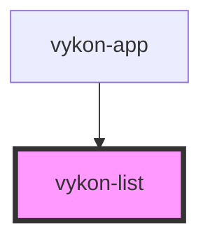

# vykon-list

<!-- Auto Generated Below -->

## Properties

| Property  | Attribute  | Description | Type     | Default |
| --------- | ---------- | ----------- | -------- | ------- |
| `apiBase` | `api-base` |             | `string` | `''`    |

## Events

| Event           | Description | Type                  |
| --------------- | ----------- | --------------------- |
| `entry-clicked` |             | `CustomEvent<string>` |

## Dependencies

### Used by

 - [vykon-app](../vykon-app)

### Graph

----------------------------------------------

*Built with [StencilJS](https://stenciljs.com/)*
